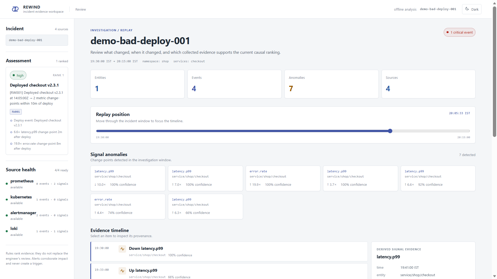
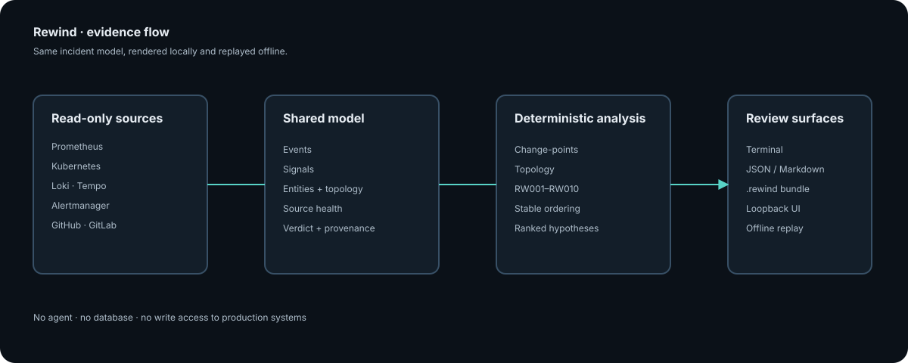

# Rewind

> Reconstruct a bounded production incident as a reviewable chain of evidence.

Rewind is a read-only incident replay engine for teams that already collect
metrics, logs, traces, alerts, and deployment events. It pulls a time window
from those systems, normalises the results into one incident model, and ranks
possible triggers with deterministic rules.

It is an early open-source project. Rewind helps organise evidence and expose
strong temporal relationships; it does not prove root cause and it does not
replace an incident review.

[](https://go.dev/)
[](LICENSE)
[](https://github.com/paultanay/rewind/actions/workflows/ci.yml)



## Why Rewind exists

During an incident, the relevant facts are usually split across several
systems. Rewind gives an engineer one portable view of:

- what changed before the impact;
- which signals changed and how strongly;
- which entities were involved;
- which sources were available or incomplete; and
- why a rule ranked one hypothesis above another.

The output is a `.rewind` bundle that can be opened and analysed offline. This
makes an investigation reproducible without retaining live credentials or
asking a reviewer to recreate the original outage.

## Five-minute demo

Requirements: Go 1.25 or newer.

```bash
go install github.com/paultanay/rewind/cmd/rewind@latest
rewind demo --scenario bad-deploy
rewind demo --scenario bad-deploy --ui
```

The demo is self-contained and does not contact a cluster. To save the result
and replay it later:

```bash
rewind demo --scenario bad-deploy -o incident.rewind
rewind ui incident.rewind
rewind investigate --replay incident.rewind
```

See [Getting started](docs/getting-started.md) for a real configuration and
[the practical Docker test](testdata/practical/README.md) for a reproducible
distributed-system exercise.

## Investigate a real window

Create `rewind.yaml` from [the configuration reference](docs/config-reference.md),
then run:

```bash
rewind sources
rewind investigate \
  --from 2026-07-09T14:00:00Z \
  --to 2026-07-09T14:45:00Z \
  --namespace shop \
  --service checkout \
  --format term \
  -o incident.rewind
rewind ui incident.rewind
```

The live run is read-only. The browser UI serves the exported incident locally
and does not need a network connection to render the bundle.

## Sources

| Source | Evidence collected |
| --- | --- |
| Prometheus | Metric series and change-points for latency, errors, resource pressure, restarts, and queues |
| Kubernetes | Deployments, pod lifecycle events, OOM kills, probe failures, node pressure, and evictions |
| Loki | Error-rate bursts and bounded log excerpts |
| Grafana Tempo | Trace error/latency signals and service topology references |
| Alertmanager | Alert lifecycle events as corroborating evidence, never as a trigger |
| GitHub / GitLab | CI/CD pipeline and merge/deployment timestamps |

Each source reports `ok`, `partial`, `failed`, or `skipped`. A useful partial
result is preserved with its error so the UI cannot imply complete coverage.

## Deterministic rules

Rules are deliberately inspectable. Use `rewind explain` to view the catalog.

| Rule | Relationship |
| --- | --- |
| RW001 | Deployment followed by a metric change-point |
| RW002 | Configuration change followed by a metric change-point |
| RW003 | Memory pressure, OOM kill, and restart chain |
| RW004 | CPU saturation preceding latency degradation |
| RW005 | Upstream error preceding a downstream change through topology |
| RW006 | Node pressure preceding pod eviction |
| RW007 | Queue lag preceding consumer latency |
| RW008 | Scale-down preceding saturation |
| RW009 | Repeated restarts coalesced into a crash-loop event |
| RW010 | Alert corroboration without allowing alerts to become triggers |

## Architecture

Collectors translate native APIs into `model.Incident`; the analysis engine
adds derived evidence and ranked hypotheses; terminal, Markdown, JSON, and the
embedded UI render the same model.



Read [Architecture](docs/architecture.md) for contracts, failure semantics,
bundle boundaries, and the local HTTP API.

## Project documentation

- [Getting started](docs/getting-started.md) — install, demo, first replay.
- [Investigation workflow](docs/investigation-workflow.md) — read the verdict,
  timeline, source health, and evidence inspector.
- [Configuration reference](docs/config-reference.md) — complete YAML and
  environment-variable mapping.
- [Source guides](docs/sources/) — prerequisites and query behaviour.
- [Bundle specification](docs/bundle-spec.md) — portable format and replay
  guarantees.
- [Operations](docs/operations.md) — CI exit codes, security, troubleshooting,
  and upgrade practices.
- [Rules](docs/rules/) — individual correlation rules and examples.
- [Contributing](CONTRIBUTING.md) — development and review expectations.
- [Security policy](SECURITY.md) — private vulnerability reporting.

## Current boundaries

Rewind currently has no hosted control plane, database, agent, or automatic
remediation. It cannot establish causality when the relevant deployment/event
source is missing, and a high score is a ranked explanation rather than a
guarantee. Source coverage and the evidence chain should be included in every
postmortem that uses Rewind.

## License

Rewind is available under the [Apache License 2.0](LICENSE).
