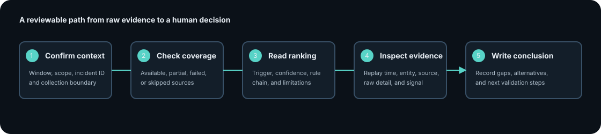

# Investigation workflow

Rewind is designed for review, not one-click diagnosis. Use the interface in
this order so the conclusion follows the evidence.

## 1. Confirm context

Start with the incident ID, time range, namespace, and service scope. A narrow
window can hide a deployment; a wide window can create unrelated correlations.

The header is descriptive only. It does not say that an incident is resolved.

## 2. Check source health

The context rail lists every configured source and its status:

- `available` means the collector returned usable data;
- `partial data` means useful data and an error were both recorded;
- `unavailable` means the source could not contribute useful data; and
- `not queried` means it was disabled or not configured.

Do not treat a clean verdict as complete if a source that should contain the
deployment or impact evidence is unavailable.

## 3. Read the assessment

Each ranked hypothesis identifies a trigger, confidence, rule IDs, explanation,
and supporting chain. The rule IDs link the result to the human-readable rule
catalog under `docs/rules/`.

Confidence ranks competing explanations in this bounded dataset. It is not a
probability and does not establish causality outside the collected evidence.

When there is no hypothesis, the correct action is to inspect anomalies and
source coverage. Rewind deliberately does not manufacture a trigger from an
alert alone.

## 4. Replay the timeline

Use the replay slider to move through the investigation window. Select an event
or anomaly to populate the evidence inspector. Review:

- timestamp and event kind;
- canonical entity identity;
- source reference and raw detail when available;
- signal direction, magnitude, score, and detector; and
- whether the item is observed or derived evidence.

The full timeline remains available while the selected item changes. The
selection is a reading aid, not a mutation or re-query.

## 5. Compare entity lanes

Entity lanes group related signals by canonical identity. Use them to compare
the timing of upstream and downstream changes. A lane does not imply a service
dependency unless the topology collector supplied that relationship.

## 6. Write the review conclusion

A defensible incident note should include:

1. the exact Rewind version and bundle ID;
2. the time range and scope;
3. source status and known gaps;
4. the top hypothesis and its rule chain;
5. contradictory or alternative evidence; and
6. the human decision about next validation steps.
